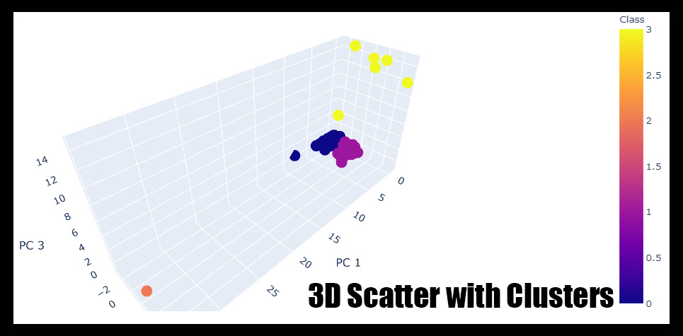

# Summary of Analysis
Accountability Accounting, a prominent investment bank, is interested in offering a new cryptocurrency investment portfolio for its customers. This analysis shows what cryptocurrencies are on the trading market and how they could be grouped to create a classification system for this new investment.

# Results of Analysis
Cryptocurrencies are still a foreign concept to many with minimal data and information to pull from. However, they could be a profittable investment/gamble for those interested.

